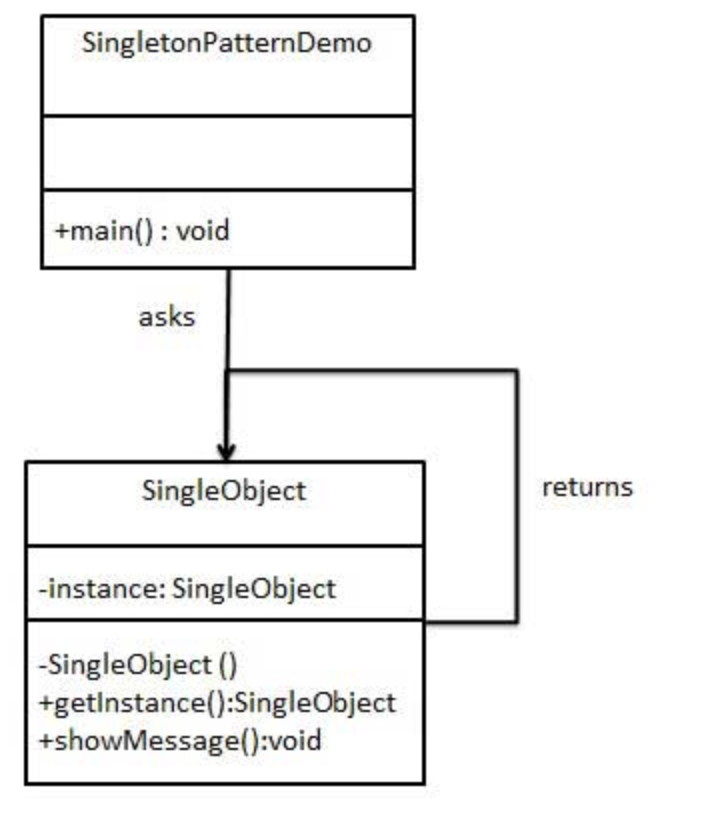

## 基本概念

单例模式属于**创建型模式**，使用该模式的类保证**全局只有一个该类实例**。


## 应用场景

1. 全局只需要存在一个该类实例
2. 该类实例被反复创建
3. 为了节省资源（该类创建耗资源）


## 实现方式

单例模式的实现有以下几种：

- 饿汉式：类加载时就存在，不管实际有没有用到。
- 懒汉式：在实际用到时再创建。
- 双重检查：懒汉式的优化。
- 静态内部类方式：目前最优选择。

#### 饿汉式

```java
public class Demo {
	private static Demo instance = new Demo();
    
    private Demo() {}
    
    public Demo getInstance() {
        return instance;
    }
}
```

优点：天然线程安全

缺点：可能造成资源浪费

#### 懒汉式
```java
public class Demo {
	private static Demo instance;
    
    private Demo() {}
    
    public Demo getInstance() {
        if(instance==null) {
            instance = new Demo();
        }
        return instance;
    }
}
```
优点：延时加载，用到才加载

缺点：线程不安全

最简单的解决线程不安全的方法是，添加synchronized关键字，但这样**多个线程的同步需要互相等待，效率过低**。

#### 双重检查

```java
public class Demo {
	private static Demo instance = new Demo(); // 添加violate关键字禁止指令重排序才能完全保证单例
    
    private Demo() {}
    
    public Demo getInstance() {
		if(instance==null) {
            synchronized(Demo.class) {
                if(instance==null) {                
		            instance = new Demo();                
                }
            }
        }
        return instance;
    }
}
```
优点：解决了上述懒汉式效率低的问题

缺点：会有指令重排序问题。一个对象的初始化分为三步：

1. 分配内存；
 	2. 对象初始化
 	3. 将指针指向这块内存地址。

**2、3两步可能会发生重排序，导致某线程获取未正常初始化的对象。**我们可以通过添加violate关键字，禁止重排序。

#### 静态内部类

```java
public class Demo {
	private Demo() {}
    
    private static class SingleTonHolder {
        private static Demo demo = new Demo();
    }
    
    public Demo getInstance() {
        return SingleTonHolder.demo;
    }
}
```

利用classloder的机制来保证初始化instance时只有一个线程。**JVM在类初始化阶段会获取一个锁，这个锁可以同步多个线程对同一个类的初始化**。


## 拓展

利用DCL（双重检查可以防止**缓存击穿**）

```java
public abstract class DoubleCheckCache {

    private Map<String, Object> localCache = new HashMap<>();

    public Object get(String key) {
        Object res = null;
        if (localCache.get(key) == null) { // 第一次检查
            synchronized (this) {
                if (localCache.get(key) == null) { // 第二次检查，其他排队请求获取锁的线程走到这里时已经能够看到缓存中的值了，也就不用再发起远程调用了
                    res = loadExternal(key);
                    localCache.put(key, res);
                }
            }
        }
        return res;
    }
    
    // 从外部加载key对应的value，通常是从数据库加载或者是发起RPC调用来加载，此操作是耗时的
    protected abstract Object loadExternal(String key);
}
```

简单介绍一下常见的三个缓存名词：

- 缓存穿透：如果大量查询一个不存在的key（db里不存在），每次走数据库会造成巨大的IO压力；可使用**布隆过滤器**有效解决。
- 缓存击穿：一个key在过期的瞬间被大量线程并发访问；
- 缓存雪崩：多个key同时过期；可对不同key随机设置不同的过期时间。


## UML类图



