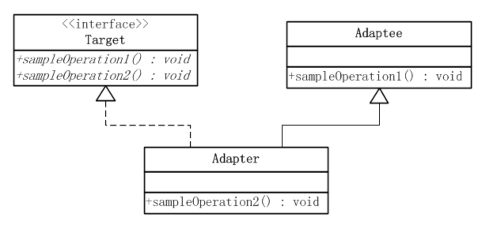
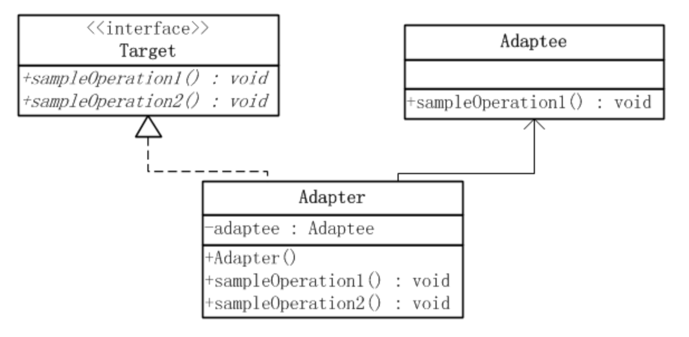

## 1. 基本概念

属于**结构型**模式，在这个设计模式中主要有三类角色：

- Target：目标接口，即用户方期待想要调用的接口
- Adaptee：实际逻辑方法，需要适配的接口
- Adapter：适配器，在其中将对Target的接口调用重定向到对Adaptee的接口调用

而适配器模式根据不同的实现方式又分为两种：

- 类适配器模式：使用**继承**的方式连接Adpter和Adaptee
- 对象适配器模式：使用**组合**的方式连接Adapter和Adaptee

## 2. 应用场景

假设客户端那层需要使用A接口，而系统内部的定义方法为B，我们希望串联起A、B，即客户端调用接口A，实际执行的是方法B，且用户感知不到，这时候就可以考虑使用适配器模式。

如Gson的TypeAdapter、SpringMVC的DispatcherServlet就是适配器模式的应用。

## 3. UML图

### 3.1 类适配器

### 3.2 对象适配器

