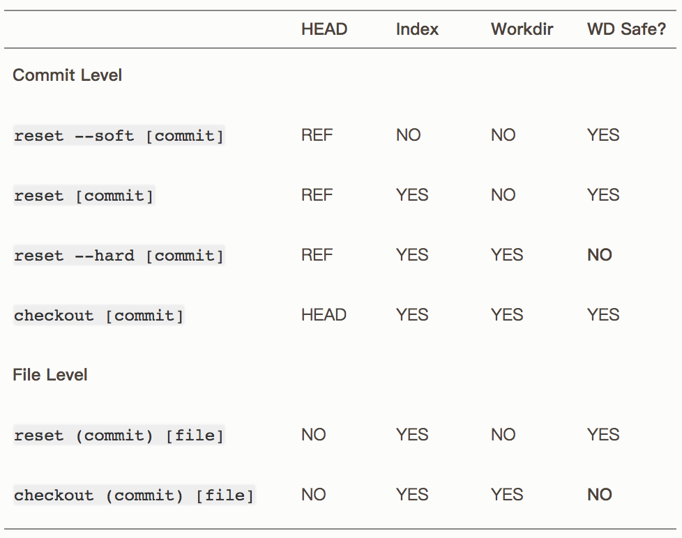
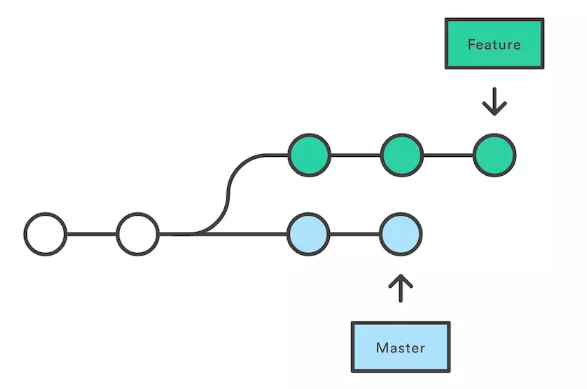
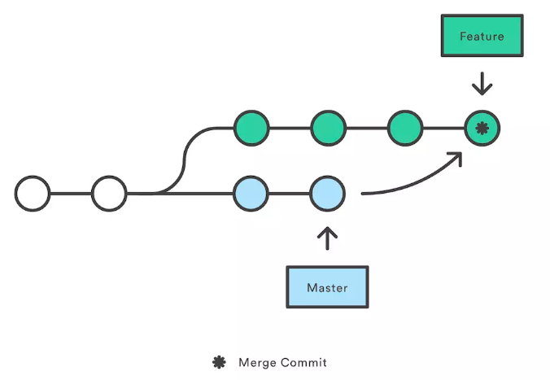
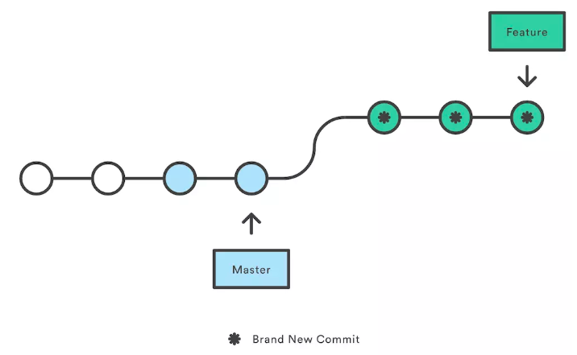

## 1.fork别人的仓库进行开发并保持同步

1. 先执行fork，然后进入自己的仓库clone项目到本地。
2. 增加远程的上游仓库跟踪 `git remote add upstream git@github.com:<user>/<repository>`
3. 保持同步：
    1.  `git fetch upstream`
    2. `git rebase upstream/master`
4. `git push origin master`
5. 提PR（Pull Request）

每次push前需要重复3-5步**保证自己的工作是在最新的稳定版本上进行**。

提PR时：

标题采用默认设置即可。默认为commit (或squash之后commit) 的**commit message**。

详细内容栏:

在第一行加上引号内的内容, `"- [ ] LGTM"`. 别人review你的代码之后就在这儿给你打个勾, **lgtm是look good to me的缩写**。

Review别人代码的时候, 如果觉得没问题, 打钩之后在底下评论"LGTM"。


## 2.git reset和git checkout的区别



[参考链接](https://git-scm.com/book/zh/v2/Git-工具-重置揭密#r_git_reset)

HEAD 头指针

Index 暂存区

workdir 工作区


`reset` 命令会以特定的顺序重写这三棵树，在你指定以下选项时停止：

1. 移动 HEAD 分支的指向 *（若指定了 --soft，则到此停止）*
2. 使索引看起来像 HEAD *（若未指定 --hard，则到此停止）*
3. 使工作目录看起来像索引


**git reset会移动分支，git checkout移动的是HEAD指针。**


## 3.git rebase和merge的区别

#### **commit history**



#### **merge**



#### **rebase**




# 4.git add -A 和 git add . 的区别

- `git add .` ：他会监控工作区的状态树，使用它会把工作时的**所有变化提交**到暂存区，包括**文件内容修改(modified)以及新文件(new)**，但不包括被删除的文件。
- `git add -u` ：他仅监控**已经被add的文件**（即tracked file），他会将被修改的文件提交到暂存区。add -u 不会提交新文件（untracked file）。（git add --update的缩写）
- `git add -A` ：是上面两个功能的合集（git add --all的缩写）


## 5.如何删除远程分支

使用`git push <remote_addr> -d/--delete <branch_name>`

如

```bash
git push origin -d mac
```

