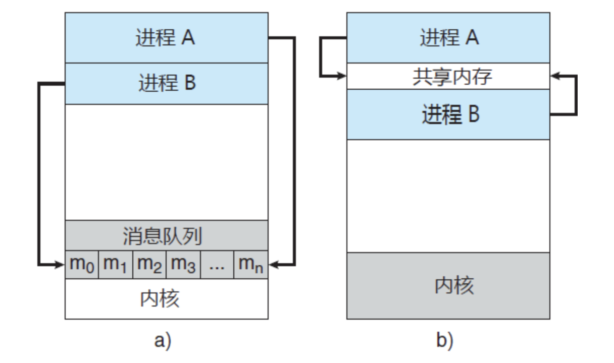

## 共享内存

存储器中划分了一块共享的**物理存储区**，并且多个进程的虚拟内存指向这一块区域实现共享，mmap的技术实现就是通过该原理；

## 管道通信

管道通信：连接读写进程以实现他们之间通信的共享文件（**pipe文件，类似先进先出的队列，由一个进程写，另一进程读，半双工**）管道分为：

- 匿名管道：只能用于父子进程、兄弟进程之间通信；
- 命名管道：可以用于毫无关联的进程间通信，与匿名管道不同，它以FIFO的形式存在于文件系统（硬盘）中；

管道都是半双工通信，**管道是单向的、先进先出的、无结构的、固定大小的字节流，它把一个进程的标准输出和另一个进程的标准输入连接在一起**

## 消息队列

相比于管道通信，消息队列的优势在于，它独立于发送和接收进程而存在。**多个进程可以对同一个消息队列收发消息**，且可以限制消息格式。**消息队列克服了以下缺点：**

- 信号传递信息少；
- 管道只能承载无格式字节流；
- 缓冲区大小受限。

## 信号量（semaphore）

主要作为进程间以及同一进程不同线程之间的同步手段。

## 套接口（Socket）

更为一般的进程间通信机制，可用于不同机器之间的进程间通信。起初是由Unix系统的BSD分支开发出来的，但现在一般可以移植到其它类Unix系统上：Linux和System V的变种都支持套接字。

## 信号（Signal）

信号是比较复杂的通信方式，用于通知接受进程有某种事件发生，除了用于进程间通信外，进程还可以发送信号给进程本身。

信号通信有以下特性：

- 信号可以在任何时候发送给某一进程，而无须知道该进程的状态。**如果该进程并未处于执行状态，则该信号就由内核保存起来，直到该进程恢复执行并传递给他为止**。

- 如果一个**信号被进程设置为阻塞**，则该信号的传递被延迟，直到其阻塞被取消时才被传递给进程。

- 信号是在**软件层次上对中断机制的一种模拟**，是一种异步通信方式，信号可以在用户空间进程和内核之间直接交互。

- 信号有以下来源

    - 硬件来源，例如按下了Ctrl+C，通常产生中断信号SIGINT；
    - 软件来源，例如使用系统调用或者命令发出信号。最常用的发送信号的系统函数是kill。

    其中有两个信号是**无法被捕获和忽略**的，即SIGKILL(`kill -9`)和SEGSTOP。

[1.线程和进程通信](https://segmentfault.com/a/1190000008732448)

[2. 进程间通信的方式](https://www.cnblogs.com/LUO77/p/5816326.html)

[3. kill命令的用途](https://www.cnblogs.com/sparkdev/p/6659629.html)

