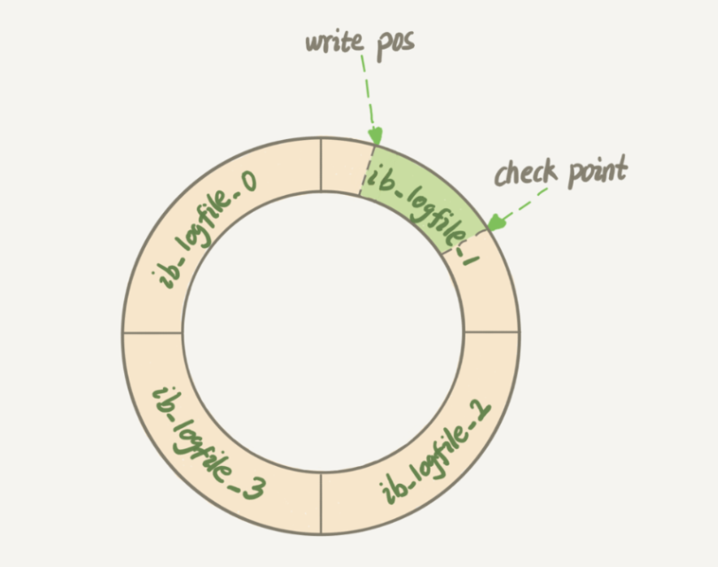
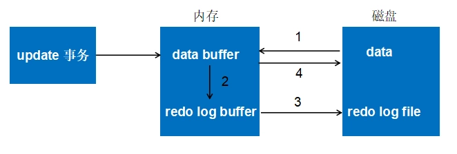

## 预写式日志

MYSQL为了事务回滚、防止宕机导致的数据丢失等错误，采用了WAL（Write-Ahead Logging，预写式日志 ）技术，即先将操作写入到日志，在进行实际操作，这样保证所有的操作都是有记录的，而MYSQL的操作记录日志有两个：

- binlog：归档日志
- redo log：重做日志

## redo log

### 基本概念

redo log是物理日志，记录的是**物理页的数据变动**，物理日志表示该日志是要搭配自己的“物理格式”使用（每个存储引擎的存储格式有差异），不一定通用。

redo log有固定大小，结构类似循环队列，有两个指针：checkpoint和wirte pos在上面不断地向后推移。根据redo log，MYSQL可以实现故障恢复。

### 何时写入redo log

1. 在数据页修改之后，在修改页（脏页）刷出磁盘之前；
2. redo log比脏页先刷到磁盘。

## binlog

binlog是逻辑日志，有多种模式，主要采用row模式，会记录行的内容，记录更新前和更新后两条。由于binlog是Sever层的日志，记录是逻辑变动，可以供别的引擎使用，这就是“逻辑”一词的意思。

binlog没有故障恢复的功能，它主要用于归档、主从备份。

## 两种日志的区别

1. redo log是InnoDB引擎特有的，之前提到过，存储引擎是以插件形式集成Sever层，所以如果MYSQL使用其他存储引擎，是不会有redo log的，而binlog是Sever层的日志，所有引擎都可以使用。这也是上面提到redo log是物理日志，binlog是逻辑日志的原因。
2. redo log的设计与事务相绑定，通过redo log可以实现事务的回滚和重放，借此实现故障恢复，而binlog的设计主要是为了主从复制，单单使用binlog并没有故障恢复能力。
3. binlog 是在**事务 commit 后一次性写入**，而 redo log 在**事务执行过程中**就会写入。

## 参考资料

1. [浅析MySQL事务中的redo与undo](https://segmentfault.com/a/1190000017888478)