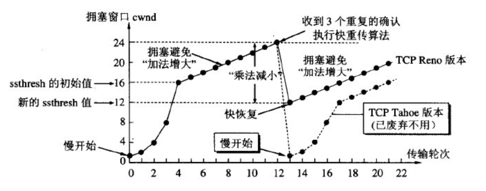
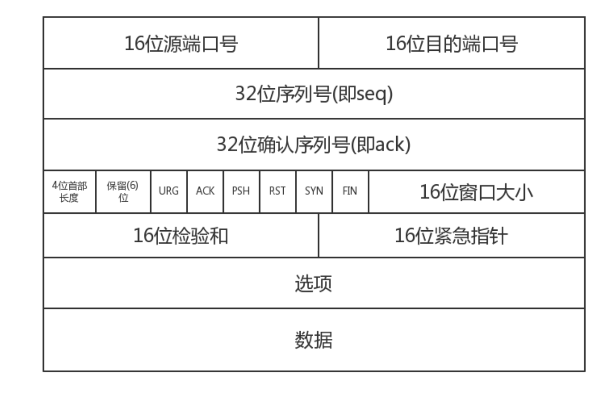

## TCP和UDP的区别

1. TCP面向连接（确认对方能接收到数据），UDP面向无连接；
2. TCP保证数据**有序、无重复、无丢失**（通过编号机制、确认和超时重传实现），UDP不保证这些；
3. TCP保证数据正确性（校验和），UDP不一定（可选）；
4. TCP报文首部大，20个字节（最大可以是60个字节），UDP8个字节，因此TCP更复杂、消耗资源更多；
5. **TCP面向字节流，UDP面向数据报；**
6. TCP的逻辑通信信道是**全双工**的可靠信道，UDP则是不可靠信道。
7. 每一条TCP连接只能是点到点的，UDP支持一对一，一对多，多对一和多对多的交互通信。

[TCP与UDP的区别](https://blog.csdn.net/m_xiaoer/article/details/72885418)

### 为什么说TCP面向字节流、UDP面向数据报

TCP的数据可能是完整的报文当中的一段（当从应用层上传下来的报文过长时，TCP会进行切割封装）。

UDP的数据就是完整的数据报，它不会对应用层的报文进行切割，而会直接交给ip，过长的话让ip进行切片。

所以**TCP/IP是面向数据流，是把数据看作一连串字节流，太大就会将其切分**，UDP的数据单位是一个报文。

[如何理解TCP/IP协议是面向数据流的，而UDP协议是面向数据报的？](https://www.zhihu.com/question/274382124)

## TCP

### TCP连接的特点

1. 确认和超时重传
2. 校验和
3. 编号机制
4. 三次握手
5. 流量控制：根据接收方的接收窗口大小调整数据发送速度。
6. 拥塞控制：网络拥堵的时候动态控制数据发送速度。
7. 快重传：收到三个重复的确认就认为是超时了，不等到超时器提醒。
8. 快恢复：当发生超时后从当前发送速率的一半开始而不是从1开始。

### TCP报文头结构

注：首部字节表示报文头长度

### TCP三次握手过程

A向B发起连接

A => SYN=1, 发送序号=x => B

A <= SYN=1, ACK=1, 发送序号=y, ack=x+1 <= B

A=> ACK=1, 发送序号=x+1, ack=y+1 => B

### TCP四次挥手

tcp是全双工连接，所以需要分别关闭服务器和客户端的读写通道（先关读后关写）。

以客户机发起关闭连接为例：
1.服务器读通道关闭
2.客户机写通道关闭
3.客户机读通道关闭
4.服务器写通道关闭

A向B断开连接

A => FIN=1, 发送序号=x => B

A <= ACK=1, ack=x+1 <= B

B向A断开连接

A <= FIN=1, 发送序号=y <= B

A => ACK=1, ack=y+1 => B

**终止tcp连接时使用shutdown和close的区别？**

shutdown可以指定某方向断开连接，比如断开读通道或写通道、close是双向通道都断开。

close会将文件描述符的引用计数-1，而shutdown会直接关闭描述符，所以对于一个socket被多个线程使用的场景，使用shutdown会使得其他线程无法对该sokcet继续操作。

## UDP

适合使用UDP的场景

1. 网络数据大多为短消息
2. 对数据安全性无特殊要求
3. 网络负担非常重，但对响应速度要求高